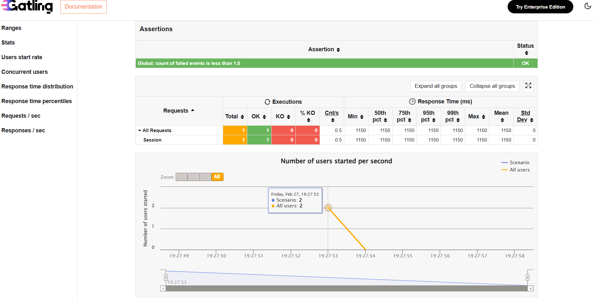
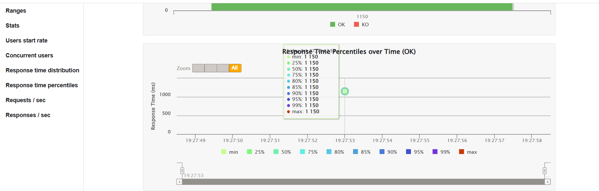
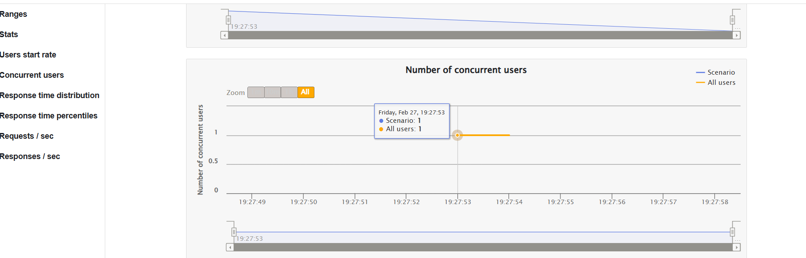

# GATLING LOAD TESTING – TASK 4

## INTERN DETAILS

**Internship Company: CODTECH IT SOLUTIONS **      

Name : GOGULAPATI LAKSHMI POORNIMA          
Intern ID : CTIS5653         
Domain : Software Testing       
Duration: 4 Weeks     
Mentor:Neela Santosh     

---

## OBJECTIVE

To perform load testing on a sample web application using Gatling (Scala) and evaluate the performance of the application under simulated user load conditions.

---

## TOOL USED

- Gatling  
- Scala  
- Java 11  

---

## TEST SCENARIO

The load test simulates a real-time user workflow on the application. 
Each virtual user performs the following actions:

1. Access the Home Page  
2. Navigate to the Login Page  
3. Submit valid login credentials  
4. Access the Account Summary page  
5. Logout from the application  

---

## LOAD CONFIGURATION

Virtual Users : 10  
Injection Type : atOnceUsers  
Execution Type : Immediate Load  

---

## SIMULATION FILE

LoadTest_Simulation.scala  

This file contains the Scala script used to execute the load test using Gatling.

---
## REPORT EXECUTION

After running the simulation, Gatling generated an HTML report.

The report was accessed locally through:

target/gatling/<simulation-folder>/index.html

The HTML file was opened in the browser to analyze performance metrics.      

## PERFORMANCE SCREENSHOTS

### 1) Summary Report

---

### 2) Response Time Graph

---

### 3) Active Users Graph

---

### 4) Requests / Detailed Statistics

---

## RESULT

All HTTP requests were executed successfully without failures.  
Response time, request statistics, and active user data were recorded properly through Gatling reports.

---

## CONCLUSION

The load testing task was completed successfully.  
The application handled the simulated load efficiently without errors, and performance metrics were analyzed using generated reports.

